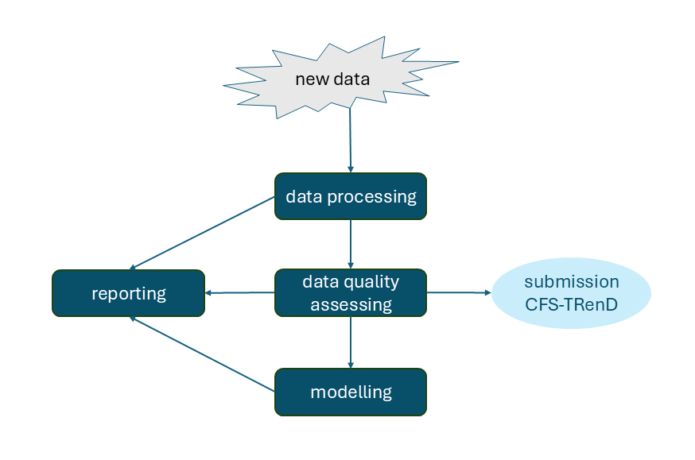

```{r setup_general, include = FALSE}
knitr::opts_chunk$set(
   echo = TRUE,
  warning = FALSE,
  message = FALSE,
  collapse = TRUE,
  comment = "#>"
)
```


```{r setup_lib, include=FALSE}
if (!requireNamespace("htmltools", quietly = TRUE)) {
  stop("Package 'htmltools' is required to run this function. Please install it.")
}
# library(CFSTRenD)
# library(data.table)
# library(ggplot2)
# library(sf)


```

# Introduction

This vignette demonstrates the main workflow of the **CFSTRenD** package for manipulating, analyzing, and visualizing tree-ring data and model performance.

The workflow includes:

-   Data loading, to import raw measurements and prepare them for analysis.

-   Data processing, which organizes and formats the data for subsequent steps.

-   Quality assessment, ensuring the reliability and consistency of the measurements.

-   Modeling, where growth trends and patterns are analyzed.

As illustrated in the following diagram, visual inspection is provided at each step to facilitate assessment of data quality and validation of results.


```{r workflow, echo = FALSE, results = 'asis', warning=FALSE, message=FALSE, out.width="80%", out.height="auto"}


# Path to the PNG inside the package


# Check existence

# Embed the image

```
------------------------------------------------------------------------
